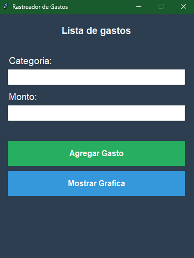
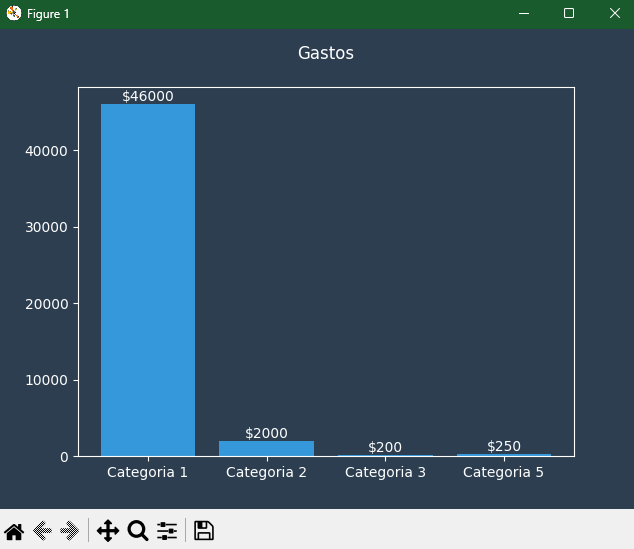

# Rastreador de Gastos

[](https://www.python.org/) [](LICENSE)

Rastreador de Gastos es una aplicación de escritorio simple desarrollada en Python que te permite registrar tus gastos por categoría y visualizarlos en un gráfico interactivo. Es ideal para quienes desean llevar un control básico de sus finanzas personales.

## Características

- **Registro de gastos:** Agrega gastos con su categoría y monto.
- **Visualización gráfica:** Genera un gráfico de barras para ver la distribución de tus gastos por categoría.
- **Interfaz gráfica amigable:** Diseñada con Tkinter para ser intuitiva y fácil de usar.
- **Personalización:** Usa un tema oscuro moderno para mejorar la experiencia visual.

## Capturas de pantalla

### Interfaz principal


### Gráfico de gastos


---

## Requisitos previos

Antes de ejecutar la aplicación, asegúrate de tener instaladas las siguientes dependencias:

- Python 3.8 o superior
- Bibliotecas requeridas:
  - `matplotlib`
  - `tkinter`

Puedes instalar las bibliotecas necesarias usando `pip`:

```bash
pip install matplotlib
pip install tkinter
'
---

# Instalación

1. Clona este repositorio en tu máquina local:
'''
 git clone https://github.com/LoBBiiTo/gastos.git'

2. Navega al directorio del proyecto:
'''
cd gastos'

3. (Opcional) Crea un entorno virtual para evitar conflictos de dependencias:
'''
python -m venv venv
venv\Scripts\activate'

4. Instala las dependencias:
'''
pip install -r requirements.txt'

# Uso

1. Ejecuta la aplicación:
'''
python main.py'

2. Ingresa los datos de tus gastos:
 - Categoría: Elige una categoría para clasificar el gasto (por ejemplo, "Comida", "Transporte").
 - Monto: Ingresa el monto del gasto.

3. Haz clic en "Agregar Gasto" para registrar el gasto.

4. Para visualizar un gráfico con la distribución de tus gastos, haz clic en "Mostrar Gráfica" .

# Contacto:
Si tenes preguntas o sugerencias, no dudes en contactarme:

Email: trubbopdev@gmail.com